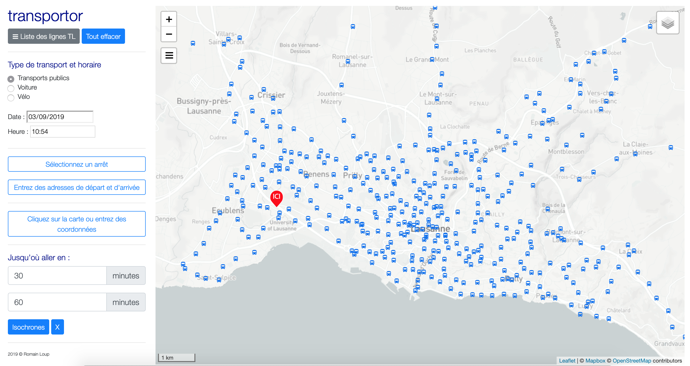
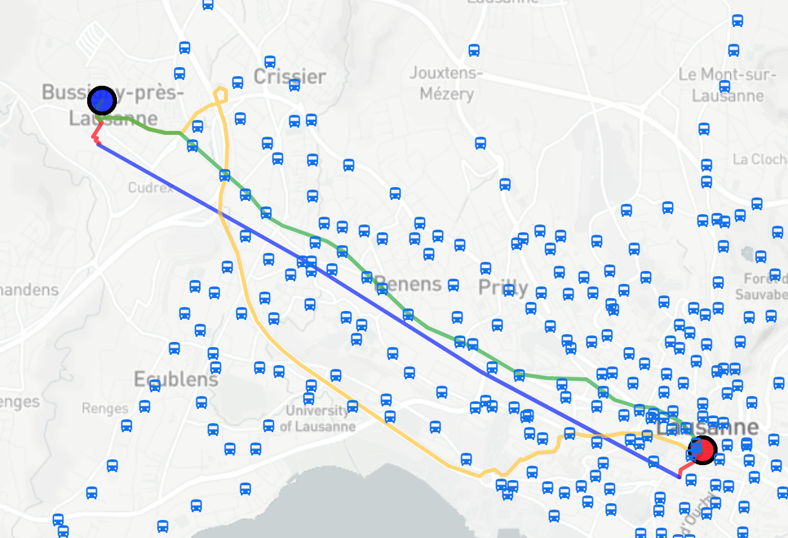
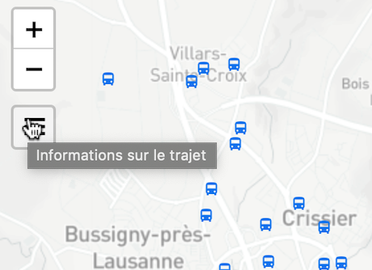
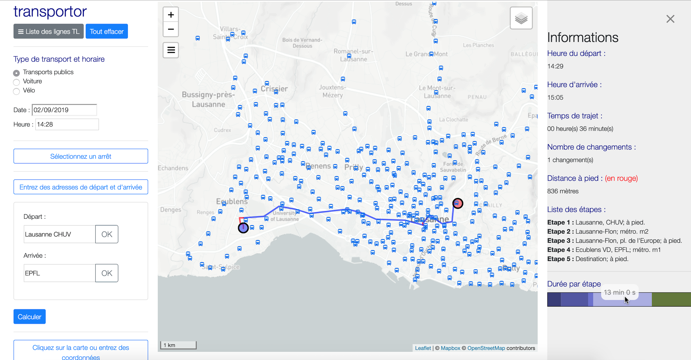
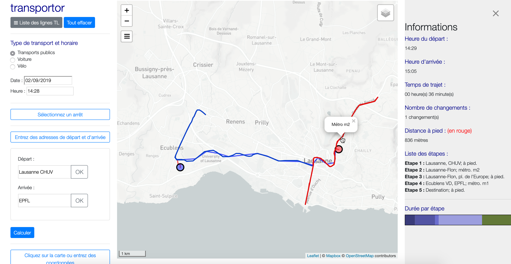
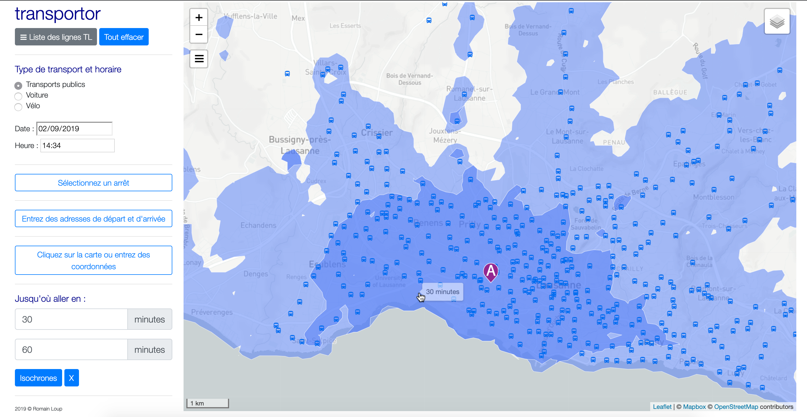

# transportor

### Informations sur les déplacements en région lausannoise

Cette application a été crée au cours de l'année 2019 afin d'être présentée pour le cours de *Visualisation de données* donné par Isaac Pante à l'Université de Lausanne.

## Comment se déplacer à Lausanne ?

Transportor est une service de planification des déplacements en transports publics, en voiture et à vélo dans la région lausannoise de manière interactive en fonction d'une date et d'une heure choisies.

Une application de cartographie s'articule évidemment autour d'une carte qui représente la majorité de l'écran. A cela s'ajoutent différentes fonctions selon la nature du problème et du public cible. Trois fond de cartes sont disponibles selon les besoins. Il peuvent être affichés en appuyant sur le bouton en haut à droite de la carte. Il est aussi possible d'afficher ou non les marqueurs représentant des arrêts en cliquant sur le menu gris "Liste des lignes TL" en haut à gauche. Ce menu déroulant permet aussi d'afficher sur la cartes les différentes lignes des TL (dont le nom s'affiche en cliquant dessus).

Le but de l'application est le calcul d'itinéraires (transports public, voiture et vélo selon la date et l'heure). Les paramètres de calcul permettent de sélectionner des points de départ et d'arrivée de la manière suivante :

-  En choissisant le nom d'un arrêt de départ et d'arrivée (des Transports Lausannois)
-  En entrant une adresse de départ et d'arrivée. Il est possible d'écrire une adresse précise ou simplement le nom d'une localité par exemple.
-  En cliquant sur la carte ou en entrant des coordonnées. Un fois un marqueur placé, il est possible de le déplacer en le glissant sur la carte. Il est aussi possible de sélectionner un arrêt en cliquant sur l'icone du bus, celle-ci deviendra verte une fois sélectionnée.

Les différents trajets s'affichent sur la carte en couleur. Le bleu représente les transports publics, le rouge la marche, le jaune la voiture et le vert le vélo. La position actuelle de l'utilisateur est représentée sur la carte par un marqueur rouge "ici".

### Tiroir "informations"

Une fois un itinéraire choisi et calculé, le tiroir informations donne des indications sur le trajet.

Les informations suivantes sont disponibles :

-  Heure de départ
-  Heure d'arrivée
-  Temps de trajet
-  Nombre de changements
-  Distance à pied
-  Liste des étapes avec une brève description
-  Barre qui représente la durée par étape (le temps de chaque étape s'affiche en passant la souris sur la barre)

Ci-dessous un trajet depuis le CHUV jusqu'à l'EPFL.

Il est ensuite possible d'afficher les lignes concernées, ici le m2 et le m1.

### Isochrones

Une autre fonction est l'affichages d'isochrones. Un isochrone est un ligne qui détermine la distance réalisable en un temps donné. Il est possible d'afficher deux isochrones en choississant le temps de parcours maximal. Le point de départ se sélectionne comme pour les déplacements.

## Fonctionnement de l'application

L'utilisation de l'application demande une certaine préparation car il utilise un serveur.

### Données

Différents types de données ont été utilisées pour cette application, dont certaines propres à l'application et d'autres issues directement d'un serveur de routing.

#### Données propres à l'applications

Tout d'abors, les arrêts de transports publics représentés par des bus bleus et l'affichage des lignes proviennent d'un fichier [GTSF](https://developers.google.com/transit/gtfs/reference/?hl=fr). Les arrêts sont simplements issus des coordonnées du fichier "stops.txt" alors que les lignes ont été crées à l'aide du logiciel R. Ce script R relie les arrêts grâce à un serveur de routing qui lie les points de la façon la plus courte par la route et utilise les trajets à pied pour les trajets de bus qui passent dans des zones interdites aux voitures. Les lignes M1, M2 et LEB sont issues d'un fond de carte OFT des voies ferrées.

#### Données de routing

Les éléments de routing proviennent d'[Open Street Planer](https://www.opentripplanner.org) (OTP). C'est à partir des données issues du calculs des itinéraires que les différentes visualisations sont possibles.

### Mise en place du serveur

Afin de faire tourner l'application, il faut lancer un serveur de routing. Un serveur de routing OPT fonctionne avec Java et doit être implémenté par quelques lignes de code. Il est possible de faire tourner un serveur de différentes manières. Premièrement, créer un serveur OPT de toutes pièces. Pour cela, il faut suivre le [tutoriel](http://docs.opentripplanner.org/en/latest/Basic-Tutorial/) OTP pour l'installation d'un serveur afin de créer son propre fichier Graph.obj. Ce type de fichier et l'agrégation d'un fichier GTFS et du système de routes d'un lieu donné. Les GTFS de la Suisse (et ailleurs) sont disponibles [ici](http://transitfeeds.com) et le fichier des routes Open Street Map est disponible [ici](http://download.geofabrik.de). Ce processus est très gourmand en RAM pour un fichier de la taille de la Suisse comme pour cette application. L'avantage est qu'il est possible de choisir sa propre région de calcul.

Une autre possibilité est donc d'utiliser le fichier Graph.obj réalisé pour cette application diponible ici METTRE LE LIEN SWITCH. Il doit être placé dans le dossier suivant : /Users/yourUserName/otpServ/graphs/default. Il suffit du coup d'éxécuter le   en remplaçant 'yourUserName' par votre nom d'utilisateur et d'éxécuter le script.

Le server s'ouvre par défaut sur le port 'localhost:8080'. Si ce port est déjà utilisé, il est possible d'en choisir un autre en le spécifiant dans le script R.

## Public cible

Cette application s'adresse à toutes personnes qui voudraient se déplacer en région lausannoise. Il est néanmoins possible de faire une requête sur toute la Suisse. Il est important que les utilisateurs doivent puissent trouver les informations recherchées facilement. Cette application pourrait facilement être adaptée pour n'importe quelle région du monde disposant de fichiers GTFS.

## Sources

- Fonds de carte : Open Street Map, disponible en ligne : https://www.openstreetmap.org/
- Fichiers GTFS : Transit Feeds, disponible en ligne : http://transitfeeds.com/
- Système des routes : Geofabrik, disponible en ligne : http://download.geofabrik.de/

---------

Copyright © 2019 - Romain Loup
